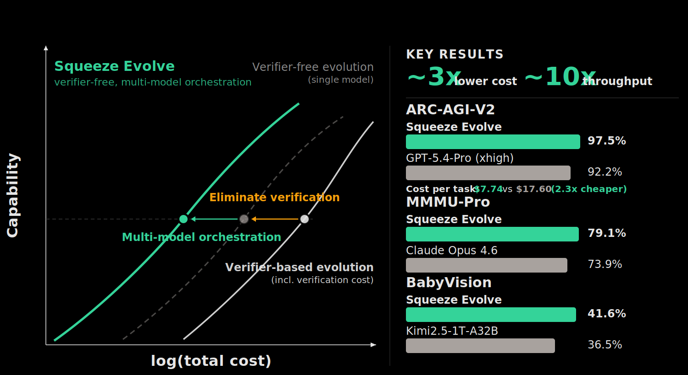
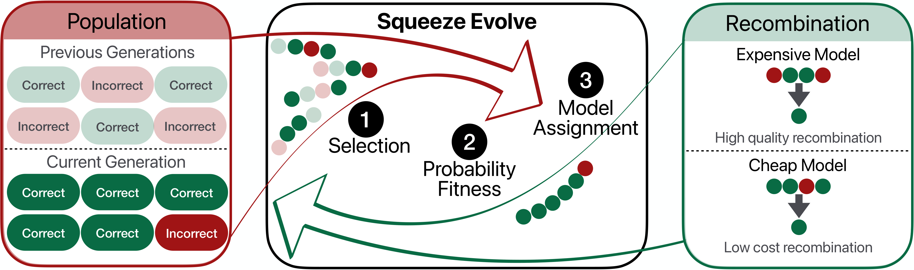

<p align="center">
  
</p>

<h1 align="center">Squeeze-Evolve</h1>

<p align="center">
  <a href="https://squeeze-evolve.github.io/"></a>
  <a href="https://arxiv.org/abs/2604.07725"></a>
</p>

<p align="center">
  
</p>

**Multi-model orchestration for verifier-free evolutionary test-time scaling.**

Squeeze-Evolve routes each step of an evolutionary inference loop to the most cost-effective model. Expensive models handle the hardest groups; cheap models handle the rest. The result: equivalent or better accuracy at a fraction of the cost.

---

## Install

```bash
# Clone with the vllm submodule
git clone --recurse-submodules git@github.com:squeeze-evolve/squeeze-evolve.git
cd squeeze-evolve

# Recommended (uv)
uv sync --dev

# Or with pip
pip install -e ".[dev]"
```

Optional extras:

```bash
# Forked vllm with custom confidence engine
VLLM_USE_PRECOMPILED=1 uv pip install --editable external/vllm

# Cloud storage for checkpoints
uv sync --dev --extra aws              # Amazon S3
uv sync --dev --extra gcs              # Google Cloud Storage
```

## Quick start

```bash
# Run the evolutionary loop on a dataset
squeeze-evolve-client \
  --config benchmarks/aime25/configs/example.yaml \
  --input data/aime25/test.parquet \
  --n-problems 5

# Save results to a file
squeeze-evolve-client \
  --config benchmarks/aime25/configs/example.yaml \
  --input data/aime25/test.parquet \
  --output results.json

# Start the HTTP server
squeeze-evolve-server --host 0.0.0.0 --port 8080
```

---

## How it works

<p align="center">
  
</p>

Squeeze-Evolve runs an evolutionary loop over a population of candidate solutions. Each loop refines the population by scoring, grouping, and recombining candidates, with the key innovation being *fitness-based routing*: each group is sent to the model best suited for its difficulty.

**Loop 0 (initialization).** The most expensive model generates an initial population of `N` candidate solutions per problem. Initialization quality is the single strongest predictor of final accuracy, so this step uses the best model available.

**Loops 1..T (evolution).** Each subsequent loop runs five stages:

1. **Score.** A fitness signal (group confidence or answer diversity) is computed for each candidate. Confidence uses token log-probabilities already produced during inference; diversity counts unique answers. Both are zero- or near-zero-cost proxies for group difficulty.

2. **Select.** Candidates are grouped into subsets of size `K`. Groups can be formed uniformly at random or via fitness-weighted sampling.

3. **Route.** Each group's fitness determines which model recombines it. Per-problem adaptive thresholds at configurable percentiles split groups into N tiers:
   - Low fitness (hard, uncertain) &rarr; most expensive model
   - High fitness (easy, consensus) &rarr; cheapest model
   - Full consensus &rarr; lightweight non-LLM aggregation (majority vote)

4. **Recombine.** Each model receives its assigned groups in parallel and generates a single refined candidate per group. The N model batches and the lite aggregation all execute concurrently.

5. **Update.** New candidates replace or accumulate into the population for the next loop.

---

## Configuration

Configs load from YAML, JSON, or Python files via `load_run_config()`.

```yaml
run_name: my_run

routing:
  k: 4                            # group size
  population: 16                   # candidates per problem (loop 0)
  groups: 16                       # groups per problem per loop (defaults to population)
  loops: 5                         # evolutionary iterations
  confidence_percentiles: [50.0]   # N-1 percentiles defining routing thresholds
  fitness: confidence              # fitness signal: confidence (GC) or diversity (D)
  selection: uniform               # selection: uniform or weighted
  selection_temperature: 1.0       # temperature for weighted selection
  update: replace                  # population update: replace or accumulate
  lite_fraction: 0.0               # fraction of easiest groups sent to lite aggregation
  lite_method: majority            # lite aggregation: majority or random
  recombination: aggregate         # prompt builder: aggregate (task-aware) or synthesize
  evaluation: none                 # evaluation: exact_match, none, or custom
  task: math                       # task type for prompt templates
  seed: 0                          # random seed (null to disable)

models:                            # ordered cheapest to most expensive
  - name: Qwen/Qwen3-30B-A3B-Instruct-2507
    base_url: http://localhost:8001/v1
    api_key: EMPTY
    max_tokens: 8192
    temperature: 0.7
    top_p: 0.8

  - name: Qwen/Qwen3-235B-A22B-Instruct-2507
    base_url: http://localhost:8000/v1
    api_key: EMPTY
    max_tokens: 8192
    temperature: 0.7
    top_p: 0.8

scoring_model:                     # model for confidence scoring (optional)
  name: Qwen/Qwen3-30B-A3B-Instruct-2507
  base_url: http://localhost:8001/v1
  max_tokens: 1
  prompt_logprobs: true
  vllm_extensions: true

resume: false
checkpoint_dir: ./artifacts/checkpoints
metrics_path: ./artifacts/metrics.json
```

### N-model routing

The `models` list supports any number of models. For N models, provide exactly N-1 values in `confidence_percentiles`. Thresholds are computed per-problem so the routing fraction adapts to each problem's difficulty.

```yaml
# 3 models require 2 percentile thresholds
routing:
  confidence_percentiles: [33.0, 66.0]

models:
  - name: cheap-model       # model_0: easiest groups (fitness above 66th percentile)
    base_url: ...
  - name: mid-model         # model_1: medium groups (between 33rd and 66th percentile)
    base_url: ...
  - name: expensive-model   # model_2: hardest groups (fitness below 33rd percentile)
    base_url: ...
```

### Scoring policy

| Setup | Scoring | Cost |
|---|---|---|
| Single model with `prompt_logprobs: true` | Self-confidence | Zero (reuses generation logprobs) |
| Multi-model | `scoring_model` with `vllm_extensions: true` | One prefill pass per candidate |
| `fitness: diversity` | Answer-level signal | Zero (no logprobs needed) |

### Storage backends

Checkpoints and metrics are written through a pluggable storage layer. The backend is selected automatically from the path prefix.

```yaml
# Local filesystem (default)
checkpoint_dir: ./artifacts/checkpoints
metrics_path: ./artifacts/metrics.json

# Amazon S3 (requires pip install squeeze-evolve[aws])
checkpoint_dir: s3://my-bucket/runs/checkpoints
metrics_path: s3://my-bucket/runs/metrics.json

# Google Cloud Storage (requires pip install squeeze-evolve[gcs])
checkpoint_dir: gs://my-bucket/runs/checkpoints
metrics_path: gs://my-bucket/runs/metrics.json
```

| Prefix | Backend | Extra |
|---|---|---|
| `./path` | Local filesystem | (built-in) |
| `s3://` | Amazon S3 | `aws` |
| `gs://` | Google Cloud Storage | `gcs` |

---

## Operator registries

Each operator is a plain function registered by name. The orchestrator resolves operators from config strings at initialization.

| Registry | Built-in | Config field |
|---|---|---|
| `fitness` | `confidence`, `diversity` | `routing.fitness` |
| `selection` | `uniform`, `weighted` | `routing.selection` |
| `lite_agg` | `majority`, `random` | `routing.lite_method` |
| `update` | `replace`, `accumulate` | `routing.update` |
| `recombination` | `aggregate`, `synthesize` | `routing.recombination` |
| `evaluation` | `exact_match`, `none` | `routing.evaluation` |

### Extending with custom operators

Import the registry for the operator family you want to extend and use the `@registry.register("name")` decorator. The registered name becomes the string you use in config YAML. All operator functions must accept `**kwargs` so the framework can pass context without breaking your signature.

**Fitness.** Receives a list of per-candidate scores for a group. Returns a single float.

```python
from squeeze_evolve import fitness

@fitness.register("entropy")
def entropy_fitness(scores, **kwargs):
    p = np.array(scores) / sum(scores)
    return float(-np.sum(p * np.log(p + 1e-10)))
```

```yaml
routing:
  fitness: entropy   # uses your registered function
```

**Selection.** Receives `(candidates, k, m, **kwargs)` where `k` is group size and `m` is group count. Must return `(groups: list[list[str]], indices: list[list[int]])`.

```python
from squeeze_evolve import selection

@selection.register("tournament")
def tournament_select(candidates, k, m, **kwargs):
    scores = kwargs["scores"]
    groups, indices = [], []
    for _ in range(m):
        pool = random.sample(range(len(candidates)), k * 2)
        winners = sorted(pool, key=lambda i: scores[i], reverse=True)[:k]
        indices.append(winners)
        groups.append([candidates[i] for i in winners])
    return groups, indices
```

**Evaluation.** Receives `(candidates: list[str], gt: Any, **kwargs)`. Returns a `dict[str, Any]` with arbitrary metric keys. Numeric values are automatically averaged across problems and emitted as `eval_<key>` in the metrics output.

```python
from squeeze_evolve import evaluation

@evaluation.register("math_boxed")
def math_eval(candidates, gt, **kwargs):
    correct = [check_boxed_equiv(c, gt) for c in candidates]
    return {
        "mean_acc": sum(correct) / len(correct),
        "pass_at_k": float(any(correct)),
        "majority_vote": float(check_boxed_equiv(majority(candidates), gt)),
    }
```

**Recombination.** Receives `(query: str, candidates: list[str], **kwargs)`. Returns a prompt string that will be sent to the assigned model.

```python
from squeeze_evolve import recombination

@recombination.register("minimal")
def minimal_prompt(query, candidates, **kwargs):
    if not candidates:
        return query
    joined = "\n".join(f"- {c}" for c in candidates)
    return f"{query}\n\nCandidates:\n{joined}\n\nPick the best answer."
```

**Lite aggregation.** Receives a `list[str]` of candidate texts. Returns a single `str`.

```python
from squeeze_evolve import lite_agg

@lite_agg.register("longest")
def pick_longest(group, **kwargs):
    return max(group, key=len)
```

**Update.** Receives `(old: list[str], new: list[str])`. Returns the next population.

```python
from squeeze_evolve import update

@update.register("best_half")
def keep_best_half(old, new, **kwargs):
    combined = old + new
    return combined[:len(combined) // 2]
```

To use custom operators, ensure your registration code is imported before the orchestrator runs. You can either import it in your config `.py` file, or place it in a directory passed via `--include-path`.

---

## Benchmarks

Ready-to-run benchmark configs in `benchmarks/` for AIME 2025, HMMT 2025, and GPQA-Diamond. Each benchmark directory contains a `run.sh` script.

```bash
# Run the AIME25 benchmark
bash benchmarks/aime25/run.sh

# Or a single config
squeeze-evolve-client \
  --config benchmarks/aime25/configs/example.yaml \
  --input data/aime25/test.parquet \
  --output results/aime25.json
```

See `benchmarks/README.md` for full details on shared settings and prerequisites.

---

## Project structure

```
src/squeeze_evolve/
  __init__.py              Public API: re-exports operator registries
  core/
    config.py              Pydantic config schema and scoring policy validation
    backend.py             OpenAI-compatible async backend with retry and batching
    data.py                Dataset loading (parquet, jsonl, json)
    storage.py             Pluggable storage backends (local, S3, GCS)
    registry.py            Generic decorator-based operator registry
  algorithm/
    operators.py           Pluggable operators (fitness, selection, routing, etc.)
    orchestrator.py        Algorithm 1 loop, metrics, checkpointing
  api/
    cli.py                 CLI entrypoints (squeeze-evolve-client, squeeze-evolve-server)
    server.py              FastAPI server (POST /run)

external/
  vllm/                    Forked vllm with custom confidence engine (git submodule)
```

The `external/vllm/` submodule contains the custom prefill path that computes confidence scores directly on GPU, achieving 4-10x lower scoring latency than the native vLLM path. Install via `VLLM_USE_PRECOMPILED=1 uv pip install --editable external/vllm`.

## Tests

```bash
uv run pytest tests/ -v    # 105 tests
```

---

## Citation

If you use Squeeze-Evolve in your research, please cite:

```bibtex
@misc{maheswaran2026squeezeevolveunifiedmultimodel,
      title={Squeeze Evolve: Unified Multi-Model Orchestration for Verifier-Free Evolution}, 
      author={Monishwaran Maheswaran and Leon Lakhani and Zhongzhu Zhou and Shijia Yang and Junxiong Wang and Coleman Hooper and Yuezhou Hu and Rishabh Tiwari and Jue Wang and Harman Singh and Qingyang Wu and Yuqing Jian and Ce Zhang and Kurt Keutzer and Tri Dao and Xiaoxia Wu and Ben Athiwaratkun and James Zou and Chenfeng Xu},
      year={2026},
      eprint={2604.07725},
      archivePrefix={arXiv},
      primaryClass={cs.AI},
      url={https://arxiv.org/abs/2604.07725}, 
}
```

## Acknowledgements

Squeeze-Evolve builds on ideas and infrastructure from the following projects:

- **[RSA (Recursive Self-Aggregation)](https://arxiv.org/abs/2509.26626)** — The evolutionary aggregation loop and recombination prompts in Squeeze-Evolve are inspired by RSA, which demonstrated that iteratively aggregating candidate reasoning chains unlocks strong test-time scaling.
- **[OpenEvolve](https://github.com/codelion/openevolve)** — An open-source evolutionary coding agent inspired by AlphaEvolve that uses LLMs to autonomously optimize code through iterative generation, evaluation, and selection.
- **[vLLM](https://github.com/vllm-project/vllm)** — The high-throughput inference engine powering the serving backend. Our fork extends vLLM with a custom confidence scoring engine for efficient group-level fitness computation.

## Contributing

Squeeze-Evolve is actively evolving research code that we are working to productionize for the community. If you run into any issues, please don't hesitate to [open an issue](https://github.com/squeeze-evolve/squeeze-evolve/issues) — contributions and feedback are very welcome!

## License

This project is licensed under the [Apache License 2.0](LICENSE).
